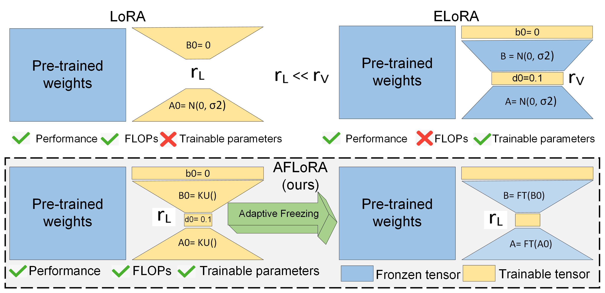
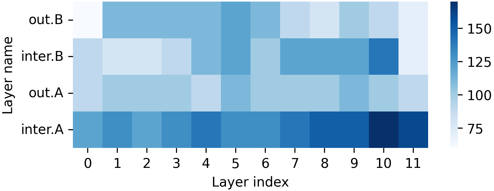
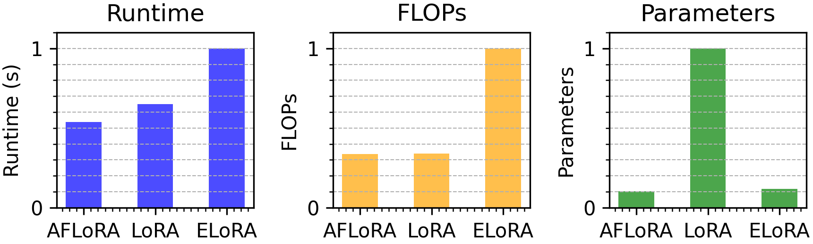

[](https://arxiv.org/pdf/2403.13269)
## [ACL 2024] AFLoRA: Adaptive Freezing of Low Rank Adaptation in Parameter Efficient Fine-Tuning of Large Models
This is the official repository of AFLoRA, accepted in ACL 2024.
## Schematic comparison of LoRA, ELoRA (VeRA), and AFLoRA

<p align="center">
  
</p>

## Contributors
1. Zeyu Liu* (USC)
2. Souvik Kundu* (Intel Labs)
   
## Directory Structure

### glue
- Modified code for running experiments on the GLUE benchmark.
- Adapted from [LoRA source code](https://github.com/microsoft/LoRA/blob/main/examples/NLU/examples/text-classification/run_glue.py) and [VeRA](https://openreview.net/forum?id=NjNfLdxr3A).
- We define the `CustomTrainerWFreeze` in `glue/trainer.py` to adptively freeze the projection matrices in the LoRA path.
- The details of how we choose a threshold to freeze the projection matrices are shown in `glue/utils.py`.

#### peft
- Modified Hugging Face [PEFT](https://github.com/huggingface/peft/) library.
- The only two relevant files for our work is `peft/src/peft/tuners/_lora.py` and `peft/src/peft/tuners/lora.py`. We reproduce [VeRA](https://openreview.net/forum?id=NjNfLdxr3A) based on their code and add our method upon that.
- The rest of the library is unchanged.

### gsm8k
- Modified code for running experiments on the GSM8K dataset.
- Adapted from [LLM-Adapters](https://github.com/AGI-Edgerunners/LLM-Adapters).
- We define the `CustomTrainerWFreeze` in `gsm8k/trainer.py` to adptively freeze the projection matrices in the LoRA path.
- The details of how we choose a threshold to freeze the projection matrices are shown in `gsm8k/utils.py`.

#### peft
- Modified Hugging Face [PEFT](https://github.com/huggingface/peft/) library.
- The only two relevant files for our work is `peft/src/peft/tuners/lora.py`. We reproduce [VeRA](https://openreview.net/forum?id=NjNfLdxr3A) based on their code and add our method upon that.
- The rest of the library is unchanged.


## Requirements (The requirements are different for the task GLUE and GSM8K)

- Python 3.10
- Run `pip install -r requirements.txt` to install necessary packages.
- Run `pip install -e ./peft` to install modified peft library.

## Main arguments

```
# For GLUE
export CUDA_VISIBLE_DEVICES='0' 
CUDA_DEVICE=$(echo $CUDA_VISIBLE_DEVICES | cut -d',' -f1)
BASE_PORT=29510
MASTER_PORT=$(($BASE_PORT + $CUDA_DEVICE)) 
torchrun --nproc_per_node=1 --master_port $MASTER_PORT run_glue.py \
         --wandb_offline 0 \ decide if use wandb in offline mode
         --do_train \
         --do_eval \
         --gradient_accumulation_steps 1 \
         --output_dir ./output \
         --overwrite_output_dir \
         --logging_steps 10 \
         --logging_dir ./output/log \
         --evaluation_strategy epoch \
         --save_strategy epoch \
         --warmup_ratio 0.06 \
         --max_grad_norm 0.1 \ gradient clip
         --weight_decay 0.1 \
         --shared_uv 0 \
         --model_name_or_path microsoft/deberta-v3-base \
         --tokenizer_name microsoft/deberta-v3-base \
         --per_device_train_batch_size 64 \
         --max_seq_length 256 \
         --mode elora \
         --lora_r 4 \ rank of LoRA
         --init_type 1 \
         --d_init_type 94 \
         --seed 42 \
         --task_name mrpc \ {mrpc, stsb, cola, ...}
         --num_train_epochs 30 \
         --classifier_lr 8e-2 \
         --learning_rate 1e-2 \
         --trainable_uv 1 \ if train the lora_A and lora_B matrices
         --disable_tqdm true \
         --freeze_by_epoch 0 \ after xxx epochs, freeze the lora_A and lora_B
         --freeze_by_ipt false \ if freeze the lora_A and lora_B based on their important scores
         --lora_dropout 0.0 \
         --load_best_model_at_end true \

# For GSM8K
export CUDA_VISIBLE_DEVICES='0' 
CUDA_DEVICE=$(echo $CUDA_VISIBLE_DEVICES | cut -d',' -f1)
BASE_PORT=29520
MASTER_PORT=$(($BASE_PORT + $CUDA_DEVICE))  
WORLD_SIZE=1
python finetune.py \
  --base_model 'yahma/llama-7b-hf' \
  --data_path 'ft-training_set/math_10k.json' \
  --output_dir './trained_models/llama-7b-math10k/' \
  --batch_size 1  --micro_batch_size 1 \
  --num_epochs 3   --learning_rate 2e-3 \
  --cutoff_len 256   --val_set_size 120 \
  --eval_step 80 --save_step 80  \
  --adapter_name aflora \
  --target_modules '["q_proj", "k_proj", "v_proj", "up_proj", "down_proj"]' \
  --lora_r 32 --lora_alpha 64 \
  --wandb_project 'llama-7b-math10k'
```

## Main Results
### Comparison of different LoRA variants with DeBERTaV3 on the GLUE benchmark.
| Method       | #Params. ↓ | CoLA ↑  | SST-2 ↑ | MRPC ↑ | QNLI ↑ | STS-B ↑ | RTE ↑  | MNLI ↑             | QQP ↑              | Avg. ↑  |
|--------------|------------|---------|---------|--------|--------|---------|--------|--------------------|--------------------|---------|
| FFT          | 184M       | 69.21   | 95.64   | 89.22  | 93.78  | 91.59   | 82.49  | 89.98/89.95        | 92.05/89.31        | 87.82   |
| LoRA (r = 8) | 1.33M      | 69.73   | 95.57   | 89.71  | 93.76  | **91.86** | 85.32  | **90.47/90.46**   | 91.95/89.26        | 88.38   |
| AdaLoRA      | 1.27M      | 70.86   | 95.95   | 90.22  | 94.28  | 91.39   | 87.36  | 90.27/90.30        | **92.13**/88.41    | 88.83   |
| SoRA (r = 4) | 0.47M      | 71.05   | 95.57   | 90.20  | 93.92  | 91.76   | 86.04  | 90.38/90.43        | 92.06/**89.44**    | 88.71   |
| ELoRA*       | 0.16M      | 70.74   | 95.18   | 90.93  | 93.58  | 91.08   | 87.36  | 90.11/90.22        | 90.69/87.63        | 88.53   |
| AFLoRA (r = 4) | **0.14M** | **72.01** | **96.22** | **91.91** | **94.42** | 91.84   | **88.09** | 89.88/90.17 | 90.81/87.77 | **89.23** |

*The original paper has results with the RoBERTa, we generated the results with our implementation on DeBERTaV3 with rank of 1024.   
**As the number of trainable parameters is changed during training, we computed this by averaging over the whole training epochs over all datasets.

### Visualization of freezing iterations for each layer. 
‘out’ and ‘inter’ refer to the second and the first MLP layer of the FFN, respectively. ‘A’ and ‘B’ represent the down-projection and up-projection matrix, respectively. The darker the color, the more iterations the matrix has to go through before freezing.
<p align="center">
  
  
</p>

## Citing
Please consider citing our paper if you find this repository useful.
```
@misc{liu2024aflora,
      title={AFLoRA: Adaptive Freezing of Low Rank Adaptation in Parameter Efficient Fine-Tuning of Large Models}, 
      author={Zeyu Liu and Souvik Kundu and Anni Li and Junrui Wan and Lianghao Jiang and Peter Anthony Beerel},
      year={2024},
      journal={ACL 2024},
}
```
## Acknowledgments
The code for this project references the following previous work:

[PEFT](https://github.com/huggingface/peft/)

[VeRA (ELoRA)](https://openreview.net/forum?id=NjNfLdxr3A)

[LoSparse](https://github.com/yxli2123/LoSparse/tree/main)

[LLM-Adapters](https://github.com/AGI-Edgerunners/LLM-Adapters).
